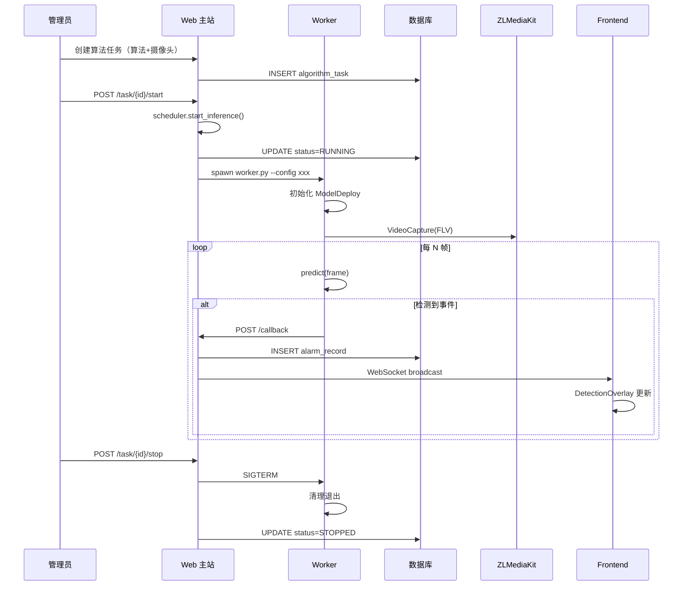

# 阶段1：单机快速验证 — 部署与测试

## 1. 环境要求

| 组件 | 版本要求 | 说明 |
|------|----------|------|
| Python | ≥ 3.10 | 推荐 3.13 |
| CUDA | ≥ 11.8（GPU 推理） | TensorRT 需要 CUDA 11.8+ |
| cuDNN | ≥ 8.6 | TensorRT 需要 |
| TensorRT | ≥ 8.5 | 可选（仅使用 TensorRT 引擎时） |
| ONNX Runtime | ≥ 1.15 | ModelDeploy 自带或系统安装 |
| CMake | ≥ 3.20 | 编译 ModelDeploy 需要 |

## 2. ModelDeploy 安装

### 方式一：从源码编译（推荐）

```bash
# 进入 ModelDeploy 源码目录
cd /path/to/ModelDeploy-main

# 安装编译依赖
pip install build scikit-build-core ninja pybind11

# GPU 版本（启用 TensorRT）
export WITH_GPU=ON
export ENABLE_TRT=ON
python -m build --wheel

# CPU 版本
export WITH_GPU=OFF
export ENABLE_TRT=OFF
python -m build --wheel

# 安装
pip install dist/modeldeploy-*.whl
```

### 方式二：pip 直接安装

```bash
pip install modeldeploy opencv-python-headless
```

注意：PyPI 发布的版本可能落后于源码，GPU 支持需要自行编译。

### 方式三：在 backend 虚拟环境中安装

```bash
cd backend
uv sync
# 激活 venv 后编译安装 modeldeploy
source .venv/bin/activate
pip install /path/to/ModelDeploy-main/dist/modeldeploy-*.whl
pip install opencv-python-headless
uv add opencv-python-headless  # 记录到 pyproject.toml
```

## 3. 模型文件准备

### 3.1 目录结构

创建模型目录：

```bash
mkdir -p data/models/{intrusion,line_crossing,crowd_count,fire_smoke,vehicle_detect,object_left,face_detect,behavior_analysis}
```

### 3.2 模型获取

| 算法类型 | 推荐模型 | 说明 |
|----------|----------|------|
| INTRUSION / LINE_CROSSING | YOLOv8n / YOLO11n ONNX | Ultralytics 官方导出 |
| CROWD_COUNT | YOLOv8n ONNX | 同上，后处理统计人数 |
| FIRE_SMOKE | 微调 YOLOv8n ONNX | 需收集烟火数据集微调 |
| VEHICLE_DETECT | YOLOv8n ONNX | 使用 COCO 类别车辆子集 |
| OBJECT_LEFT | YOLOv8n ONNX + 逻辑 | 需添加遗留物判断逻辑 |
| FACE_DETECT | SCRFD ONNX + ArcFace ONNX | 人脸检测 + 特征提取 |
| BEHAVIOR_ANALYSIS | YOLOv8n-pose ONNX | 关键点检测 |

### 3.3 模型导出（以 YOLOv8 为例）

```python
from ultralytics import YOLO

# 训练或下载预训练模型
model = YOLO("yolov8n.pt")

# 导出 ONNX
model.export(format="onnx", imgsz=640)

# 导出 TensorRT（需 GPU）
model.export(format="engine", imgsz=640, device=0)
```

### 3.4 测试模型加载

```python
from modeldeploy.vision import UltralyticsDet
option = RuntimeOption()
option.use_gpu(0)
option.use_ort_backend()

model = UltralyticsDet("data/models/intrusion/engine.onnx", option)
model.postprocessor.conf_threshold = 0.5

# 测试推理
import cv2
img = cv2.imread("test.jpg")
results = model.predict(img)
print(f"Detected {len(results)} objects")
```

## 4. 开发配置

### 4.1 settings.py 新增

```python
# inference
INFERENCE_CALLBACK_TOKEN: str = "infer_shared_secret_change_me"
DETECTIONS_DIR: str = str(PROJECT_ROOT / "data/detections")
```

### 4.2 启动

```bash
# 后端
cd backend
uv run main.py run --env=dev

# 前端
cd frontend
pnpm run dev
```

## 5. 验证步骤

### 5.1 单元测试

```bash
# 1. 测试 registry 映射
cd backend && uv run python -c "
from app.api.v1.module_video.inference.registry import ALGORITHM_TYPE_MAP
assert 'INTRUSION' in ALGORITHM_TYPE_MAP
print('registry OK')
"

# 2. 测试 schema 序列化
uv run python -c "
from app.api.v1.module_video.inference.schema import DetectionEventSchema
import json
with open('test_detection.json') as f:
    data = json.load(f)
event = DetectionEventSchema(**data)
print(f'deserialized: {event.algorithm_type}')
"
```

### 5.2 集成测试流程



### 5.3 手动测试步骤

```bash
# 1. 启动后端
cd backend && uv run main.py run --env=dev

# 2. 确认路由注册
curl http://localhost:8001/api/v1/algorithm/list | python -m json.tool

# 3. 创建算法（通过管理页面）
# 设置 model_path 为已部署的模型文件

# 4. 创建布控任务（通过 deploy 页面）
# 选择摄像头 + 算法

# 5. 启动推理
curl -X POST http://localhost:8001/api/v1/algorithm/task/1/start \
  -H "Authorization: Bearer $(获取token)"

# 6. 检查状态
curl http://localhost:8001/api/v1/algorithm/task/1/inference-status

# 7. 检查告警记录
curl http://localhost:8001/api/v1/alarm/record/list

# 8. 停止推理
curl -X POST http://localhost:8001/api/v1/algorithm/task/1/stop

# 9. 验证 Worker 日志
ls /tmp/infer_*.json  # 配置文件应已被清理
```

## 6. 常见问题

### Worker 启动失败

检查：
- 模型路径是否存在（绝对路径）
- GPU 是否可用：`nvidia-smi`
- ModelDeploy 是否正确安装：`python -c "import modeldeploy; print(modeldeploy.get_version())"`
- OpenCV 是否能打开流：`ffplay <stream_url>`

### 检测不到事件

检查：
- `conf_threshold` 是否过高（调至 0.25 测试）
- 模型类别是否匹配（COCO 80 类 vs 自定义类别）
- 检测区域是否覆盖了画面

### 告警未推送

检查：
- `AlarmRuleModel` 是否配置了该 camera + alarm_type
- `notify_channels` 是否包含 `WS_PUSH`
- WebSocket 是否已连接
